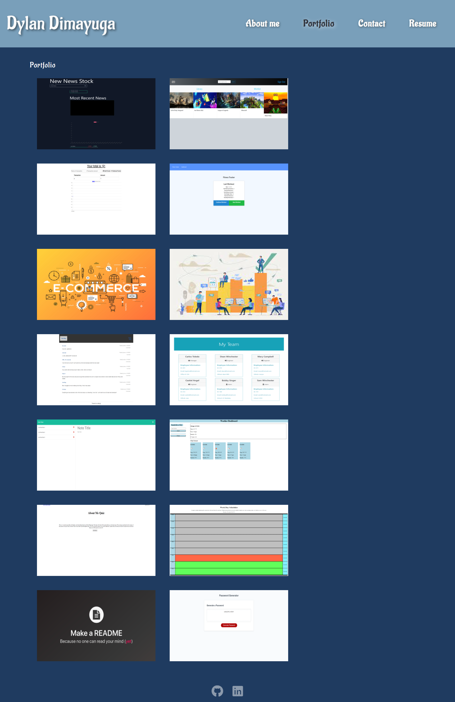

  # React-Portfolio

    

  ## Description
    Creating a portfolio containing information about myself, projects I have created, contact page, and a resume page.
    
  ## Table Contents
  
  - [Installation](#installation)
  - [Usage](#usage)
  - [Credits](#credits)
  - [License](#license)
  
  ## Installation
  Follow my github link below to find the active application.
  
  ## Usage
  Open up the application and navigate through the different pages to view the whole application.

  ## Credits
  Northwestern University Coding Boot Camp

  ## License
  This page is covered by an N/A license. Follow the link to the license page.

  ## Questions
    Github: (https://github.com/dylandimayuga)
    Email: dylandimayuga@yahoo.com
